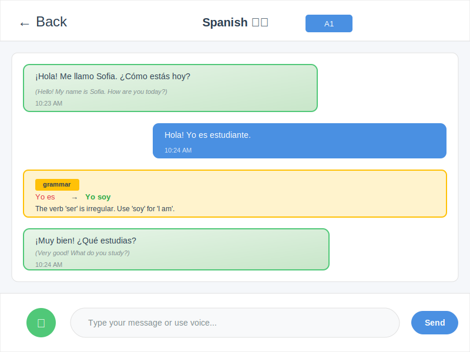

## Hi there, I'm Pieter Kuppens

Experienced software, data, and AI professional. From ASML metrology and Philips Healthcare to CART-Tech and Nemo Healthcare—20+ years across high-tech, healthcare, and finance.

## AI Coding Skills Library

This repo hosts a unified skills library for Cursor, Claude, and Codex: arc42-aligned workflows from ideation to deployment. See [skills/SKILL_TREE.md](skills/SKILL_TREE.md) for the full index.

## Current Projects

### 🔒 On-Premise RAG System

On-premise RAG for semantic search on your documents. Vector embeddings, semantic search, and LLM capabilities—all data stays on-premises. Built for healthcare, finance, and legal where data sovereignty matters.

   

**Status**: 🟢 Active Development

---

### 🗣️ [Babblr: AI Language Learning](https://github.com/pkuppens/babblr)

Natural conversation over gamification. Adaptive AI tutor with real-time grammar and vocabulary support. Electron, FastAPI, Whisper, Claude. Spanish, Italian, German, French, Dutch—CEFR A1–C2.

    

**Repository**: [github.com/pkuppens/babblr](https://github.com/pkuppens/babblr) · **License**: AGPL-3.0 · **Status**: 🟢 Active Development

## Earlier Career

Software development at ASML (EUV metrology, source positioning), Philips Healthcare (3D ablation visualization), ABN AMRO (mortgage, security), and Mapscape (GIS/navigation). Recent AI work: Deep Learning for cardiac tissue segmentation at CART-Tech (pacemaker lead placement); migration to AWS for model scalability. JIRA/Confluence workflows for medical device (Nemo Healthcare). AI anomaly detection for financial transactions. Medication decision rules and hospital data integration (Isatis, Nemo).

## Certifications & Training

- **AWS Cloud Practitioner**
- **Microsoft Professional Program in Data Science** (2017–2018)
- Several AI/ML trainings
- Ongoing learning via PluralSight

## Interests

- AI and data: Deep Learning, LLMs, ML, agentic systems
- Healthcare, finance, high-tech
- Technical collaboration and continuous improvement
- Open to freelance assignments near Den Bosch or remote

---

Explore my repositories and connect on [LinkedIn](https://www.linkedin.com/in/pieterkuppens/).
